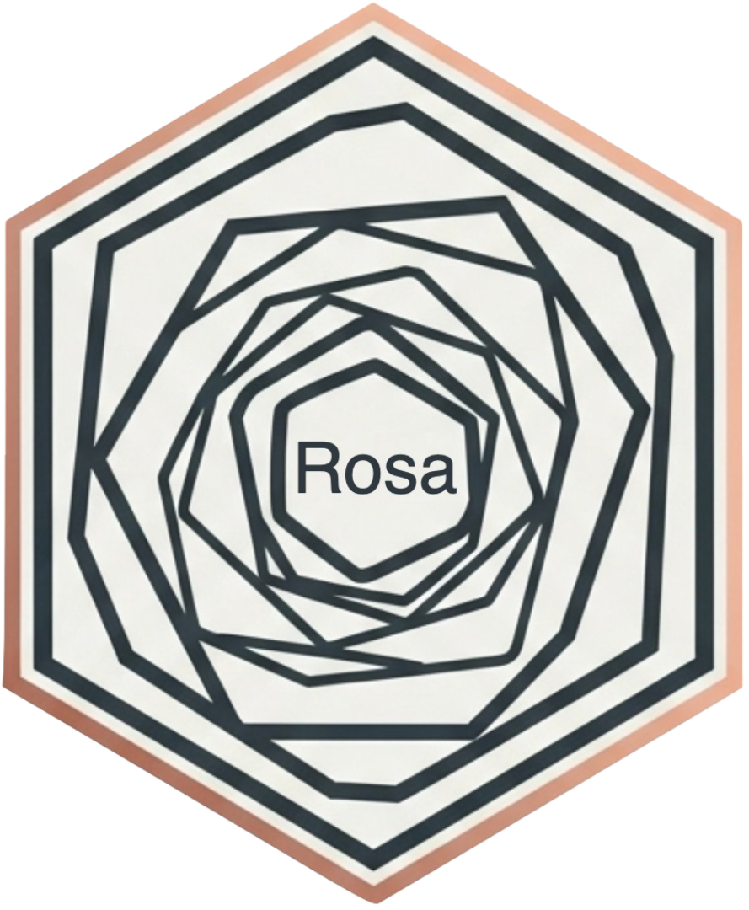

# Rosa <a href='https://github.com/laresbernardo/Rosa' target="_blank"></a>

## MMM Interface powered by Robyn

Powerful Marketing Mix Models (MMM) interface powered by Robyn. Seamlessly manage end-to-end projects, regardless of your coding expertise, enabling in-depth analysis, addressing crucial business queries on attribution, incrementality, and budget optimization. Rosa's dynamic interface harmonizes technical intricacies with user-friendly functionality, fostering collaboration and empowering users to navigate MMM complexities confidently. This innovative solution propels advertisers towards data-driven decision-making, providing invaluable insights into market dynamics and contributing to strategic decision-making worldwide.


## App Quick Start

  * Install/update `Rosa` package in R:
```{r}
## DEV VERSION
# If you don't have remotes installed yet, first run: install.packages("remotes")
remotes::install_github("laresbernardo/Rosa")
```
  * Launch `Rosa` UI by running in R:
```{r}
Rosa::launch()
```

---
## Key Features

Breakdown of the key features:

* **User-Friendly Interface**: Our design caters to a wide audience, including non-technical business and marketing experts, as well as data scientists.
* **Secure & Private Deployment**: This is a standalone solution that you can run locally or on a secure cloud, guaranteeing no data leaks.
* **Proven Performance**: We've validated our solution across various international markets and with diverse brands.
* **AI-Powered**: We leverage AI tools to assist and automate processes. This helps reduce human bias and improve delivery times. Examples include an AI Assistant trained with documentation, Dataset AI for data interaction, and ML Algorithms.
* **Comprehensive MMM Workflow**: Our end-to-end documented workflow covers everything from data preparation to insights and budget allocation.
* **Robyn-Powered Core**: Built upon and fully interoperable with Robyn as its core engine, our solution is enhanced with unique additional features.
* **Scenario Simulation**: We provide the ability to simulate various scenarios, effectively answering real-world business questions.
* **Automated Reporting**: The solution generates editable PowerPoint reports, offering actionable and simplified outputs.
* **Extended Functionality**: We include additional features such as logs, model recreation, model refreshing, exporting, AI chat capabilities, and more.

---
## Setup environment variables to enable some features (replace with proper values):
```{r}
## OpenAI ChatGPT (no chat) (available in Documentation)
Sys.setenv("OPENAI_BASE" = "endpoint")
Sys.setenv("OPENAI_VERSION" = "api_version")
# If version is not defined, "2024-02-15-preview" is used
Sys.setenv("OPENAI_API" = "api_key")
Sys.setenv("OPENAI_MODEL" = "gpt-4o-latest")
# If model is not defined, "gpt-4o-latest" will be used

## OpenAI Rosa Chat Assistant (available in top menu icon)
Sys.setenv("OPENAI_ASSISTANT" = "assistant_id")
# And uses same variables as OpenAI ChatGPT above for:
# OPENAI_BASE, OPENAI_VERSION, OPENAI_API

## Store logs in Azure Table
Sys.setenv("AZURE_STORAGE_LOGS" = "table_name")
Sys.setenv("AZURE_STORAGE_NAME" = "storage_account_name")
Sys.setenv("AZURE_STORAGE_KEY" = "storage_account_key")

## Upload JSON files to Azure Storage Account (available in Results)
Sys.setenv("AZURE_APP_ID" = "app_id")
Sys.setenv("AZURE_APP_SECRET" = "app_secret")
Sys.setenv("AZURE_TENANT" = "tenant")
Sys.setenv("AZURE_STORAGE_ACCOUNT" = "storage_account")
Sys.setenv("AZURE_CONTAINER" = "container")
```
